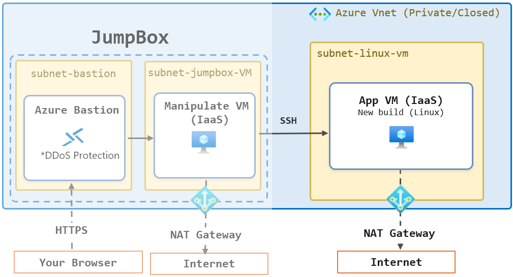

\[[In English](#create-a-linux-virtual-machine-in-an-isolated-virtual-network-environment)\]

# 仮想ネットワーク内の閉域環境への Linux 仮想マシンの作成

このハンズオンでは、仮想ネットワークで閉域化された環境に Linux 仮想マシンをデプロイする手順を説明します。

エンタープライズのオンプレミス環境からの移行では、セキュリティ上の理由から、インターネットに接続されていない閉域化された環境で仮想マシンを運用することが求められる場合があります。Azure では、仮想ネットワークを使用して、インターネットに接続されていない閉域化された環境を構築することができます。

このハンズオンでは、仮想ネットワークで閉域化された環境に Linux 仮想マシンを作成し、Jump Box マシンから SSH を使用してアクセスするまでの手順を説明します。

# 前提条件

* Azure サブスクリプションが有効であること
* Azure ポータルにアクセスできること
* Azure の管理者権限または共同作成者権限を持っていること
* 以下のハンズオンを完了し、Azure 移行のための VHD ファイルが作成されており、仮想マシンのデプロイ環境となる仮想ネットワークが作成されていること
    * [Azure の仮想ネットワークで閉域化された環境に安全にアクセスするための Jump Box 環境の構築](https://github.com/osamum/HowtoMake-Az-JumpBox-Env)

# この手順で構築される環境

仮想ネットワークで閉域化された環境に Linux 仮想マシンを作成します。

作成された仮想マシンの操作は、Jump Box マシンのデスクトップから、SSH を使用して行います。

# 手順

1. [作成する仮想マシン用のサブネットを作成](jp-ex01.md)
2. [Linux 仮想マシンを作成し、Jump Box マシンから SSH 接続で操作](jp-ex02.md)

 

# Create a Linux Virtual Machine in an Isolated Virtual Network Environment

This hands-on exercise explains how to deploy a Linux virtual machine in an isolated virtual network environment.

When migrating from an enterprise on-premises environment, virtual machines may need to operate in an isolated environment without internet connectivity for security reasons. In Azure, you can use a virtual network to create an isolated environment that is not connected to the internet.

This hands-on exercise explains how to create a Linux virtual machine in an isolated virtual network environment and access it from a Jump Box using SSH.

# Prerequisites

* An active Azure subscription
* Access to the Azure portal
* Azure administrator or contributor permissions
* Completion of the following hands-on exercise, with a VHD file for Azure migration and a virtual network for the virtual machine deployment environment already created
    * [Build a Jump Box Environment for Secure Access to an Isolated Azure Virtual Network](https://github.com/osamum/HowtoMake-Az-JumpBox-Env)

# Environment Created in This Exercise

You will create a Linux virtual machine in an isolated virtual network environment.

You will operate the virtual machine from the Jump Box desktop using SSH.

# Steps

1. [Create a Subnet for the Virtual Machine](en-ex01.md)
2. [Create a Linux Virtual Machine and Connect to It from the Jump Box Using SSH](en-ex02.md)