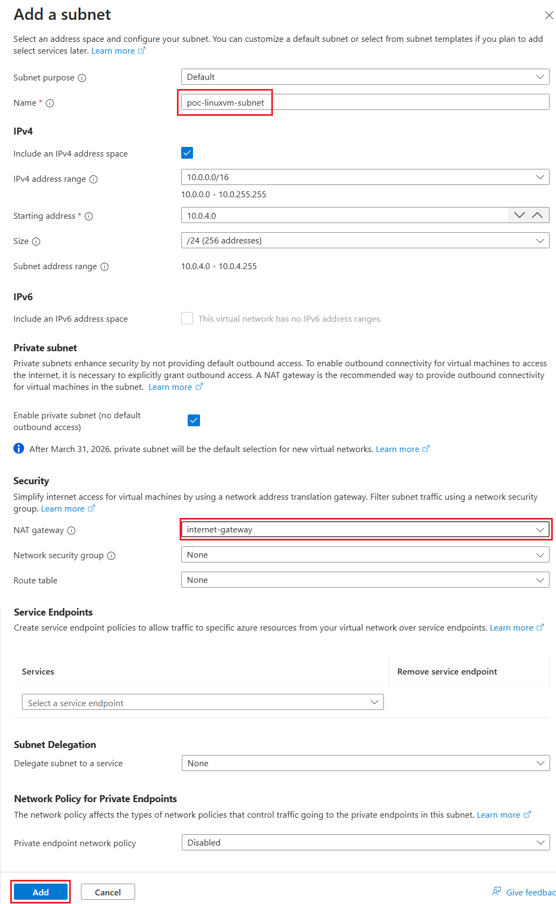

# Exercise 1: Create a Subnet for the Virtual Machine

In this exercise, you will create a subnet for the virtual machine that will be migrated to an existing Azure virtual network. The virtual machine being migrated must run in a dedicated subnet.

This exercise assumes that the virtual network and Jump Box described in the following document have already been created. Complete the steps in that document before proceeding.

* [**Build a Jump Box Environment for Secure Access to an Isolated Azure Virtual Network**](https://github.com/osamum/HowtoMake-Az-JumpBox-Env)

Follow these steps to create a subnet for the virtual machine that will be migrated to the existing Azure virtual network.

\[**Steps**▶️\]

1. In the [Azure portal](https://portal.azure.com/), open the target virtual network.
   
2. From the menu on the left, select \[Settings\] - \[**Subnets**\], and then select \[**+ Subnet**\] from the menu at the top of the page.

   

3. The \[**Add subnet**\] pane appears on the left. Configure each setting as follows.

    |Setting|Value|
    |:---|:---|
    |Purpose|Default|
    |Name \*|`poc-linuxvm-subnet`|
    |Include an IPv4 address space|**Selected**|
    |IPv4 address range|(Keep the default value)|
    |Starting address \*|(Keep the default value)|
    |Size|(Keep the default value)|
    |Include an IPv6 address space|Not selected|
    |Enable private subnet (no default outbound access)|Selected|
    |NAT gateway|Select `internet-gateway` (Note)|
    |Network security group|None|
    |Route table|None|
    |Service|Do not specify|
    |Subnet delegation|None|
    |Private endpoint network policy|Disabled|

    

    **Note:** Select the NAT gateway created by following [Create a Virtual Network Environment](https://github.com/osamum/HowtoMake-Az-JumpBox-Env/blob/main/jp-ex01.md).

    After configuring the settings, select \[**Add**\] at the bottom of the pane to create the subnet.

You have now added a subnet for the virtual machine that will be migrated to the existing virtual network.

 

## Next

👉　[**Exercise 2: Create a Linux Virtual Machine and Connect to It from the Jump Box Using SSH**](en-ex02.md)

---

🏚️　[Back to README](README.md)