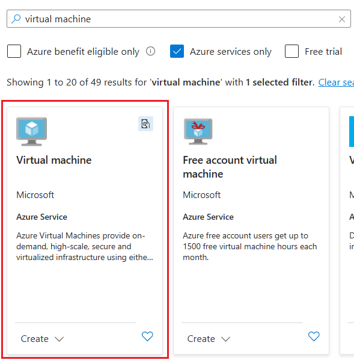
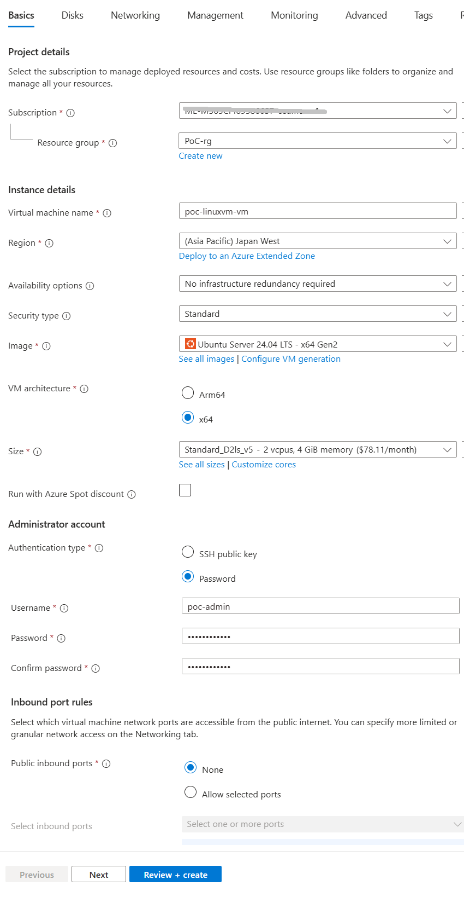
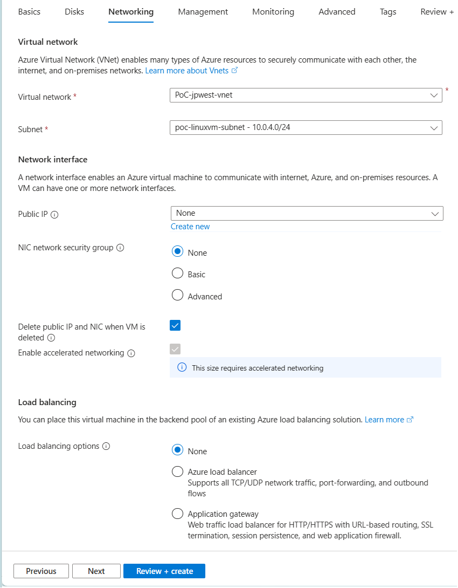
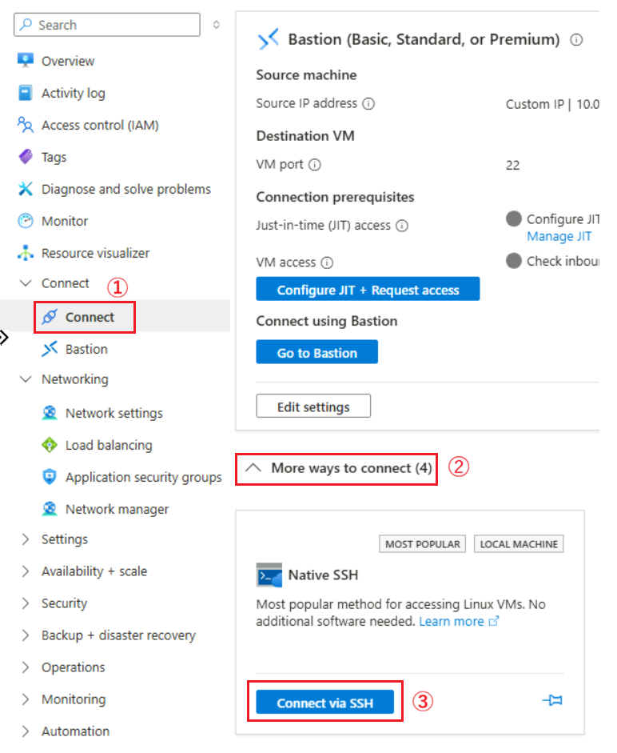
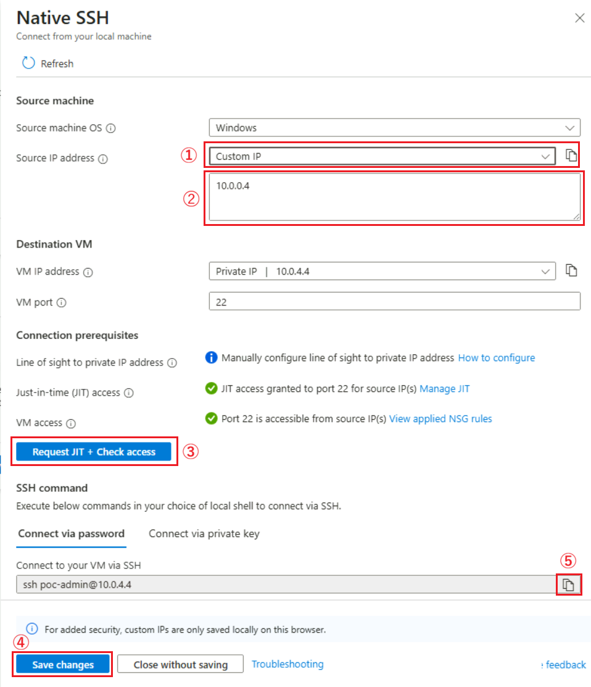

# 手順 2 : Linux 仮想マシンを作成し、Jump Box マシンから SSH 接続で操作

仮想ネットワークで閉域化された環境に新規の Linux 仮想マシンを作成してデプロイします。その後、Jump Box マシンから SSH を使用して仮想マシンにアクセスし、接続確認を行います。

具体的な手順は以下のとおりです。

\[**手順**▶️\]

1. [Azure ポータル](https://portal.azure.com/)にログインし、ポータル画面上部の \[**+**\] リソースの作成アイコンをクリックします。アイコンが表示されていない場合は、画面左上のハンバーガーメニューをクリックし、\[**リソースの作成**\] をクリックします

    

2. \[**リソースの作成**\] 画面に遷移するので、検索ボックスに `仮想マシン` と入力し、表示された検索結果の \[**仮想マシン**\] のタイルをクリックします

    

3. \[**仮想マシン**\] の画面に遷移するので、\[**作成**\] ボタンをクリックします

4. \[**仮想マシンの作成**\] の画面の \[**基本**\] タブに遷移するので、各項目を以下のように設定します

    **プロジェクトの詳細**

    |項目|設定値|
    |:---|:---|
    |サブスクリプション \*|使用するサブスクリプション|
    |リソース グループ|\[*任意のリソースグループ*\]|

    **インスタンスの詳細**

    |項目|設定値|
    |:---|:---|
    |仮想マシン名 \*|`poc-linux-vm`|
    |地域 \*|\[**(Asia Pacific) Japan West**\]|
    |可用性オプション|\[**インフラストラクチャ冗長は必要ありません**\](※1)|
    |セキュリティの種類|\[**Standard**\]|
    |イメージ \*|**Ubuntu Server 20.04 LTS**|
    |VM アーキテクチャ|\[**x64**\]|
    |サイズ|*任意のものを選択します*|

    **管理者アカウント**

    |項目|設定値|
    |:---|:---|
    |認証の種類 \*|\[**パスワード**\]|
    |ユーザー名 \*|`poc-admin`|
    |パスワード \*|`P@ssw0rd1234`|
    |パスワードの確認 \*|`P@ssw0rd1234`|

    **受信ポートの規則**

    |項目|設定値|
    |:---|:---|
    |パブリック受信ポート \*|\[**なし**\]|

    

   設定が完了したら \[**次: ディスク >**\] ボタンをクリックします

5.  \[**ディスク**\] タブの画面に遷移しますが、既定のままで \[**次: ネットワーク >**\] ボタンをクリックします

    なお、\[**OS ディスクの種類**\] で、任意のディスクを選択してもかまいません。

6. \[**ネットワーク**\] タブの画面に遷移するので、各項目が既定で以下のように設定されていることを確認します。なお、**仮想ネットワーク** と **サブネット** はこの演習で作成したものを選択します。

    **ネットワーク インターフェイス**

    |項目|設定値|
    |:---|:---|
    |仮想ネットワーク \*|\[**PoC-jpwest-vnet**\]|
    |サブネット \*|\[**poc-linuxvm-subnet**\]|
    |パブリック IP|\[**なし**\]|
    |NIC ネットワーク セキュリティ グループ|\[**なし**\] にチェック|
    |VM が削除されたときにパブリック IP と NIC を削除する|(※任意)|
    |高速ネットワークを有効にする|チェック|

    **負荷分散**

    |項目|設定値|
    |:---|:---|
    |負荷分散のオプション|\[**なし**\] にチェック|

     

    設定が完了したら \[**確認および作成**\] ボタンをクリックし、\[**作成**\] ボタンが有効になったらクリックしてデプロイを開始します。

7. 仮想マシンのデプロイが完了すると \[**リソースに移動**\] ボタンが表示されますが、ここではクリックせずに Jump Box マシンのデスクトップにログインします

8. ターミナルを起動し、 `ipconfig` コマンドを実行して、Jump Box マシンの IP アドレスを確認してメモしておきます

9. Jump Box マシン内の Web ブラウザーで Azure ポータルにアクセスし、作成した仮想マシンのリソース画面を開きます。

10. 画面左のメニューから \[**接続**\] をクリックし、遷移した画面内の項目 \[**その他の接続方法**\] をクリックして内容を展開します

    表示された \[**ネイティブ SSH**\] タイルの \[**SSH 経由で接続**\] ボタンをクリックします。

    
    
11. 画面右側に \[**ネイティブ SSH**\] ブレードが表示されるので、以下のように設定します
 
    |項目|設定値|
    |:---|:---|
    |ソース マシンの OS|`Windows`|
    |ソース IP アドレス|\[**Custom IP**\]/*Jump Box の IP アドレス*|
    
12. \[**アクセスの確認**\] ボタンをクリックします

    Just-in-time (JIT) アクセスが有効になったら、\[**変更内容の保存**\] ボタンをクリックして設定を保存し、\[SSH 経由で VM に接続\] ボックスのコピーボタンをクリックして、接続コマンドを取得します。

    

13. Jump Box マシンのターミナル画面から取得した SSH 接続コマンドを使用して、作成した Linux 仮想マシンに接続します。

ここまでの手順で、仮想ネットワークで閉域化された環境に Linux 仮想マシンを作成し、SSH 接続でログインすることができるようになりました。

なお、仮想ネットワーク内の閉域化された環境にデプロイされた仮想マシンを管理するには、必ず Jump Box 上の Web ブラウザーを使用して Azure ポータルにアクセスする必要があります。

 

👈 [**手順 1 : 作成する仮想マシン用のサブネットを作成**](jp-ex01.md)

---

🏚️　[README に戻る](README.md)